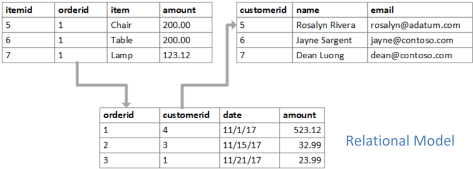
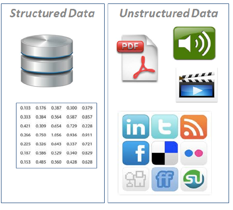
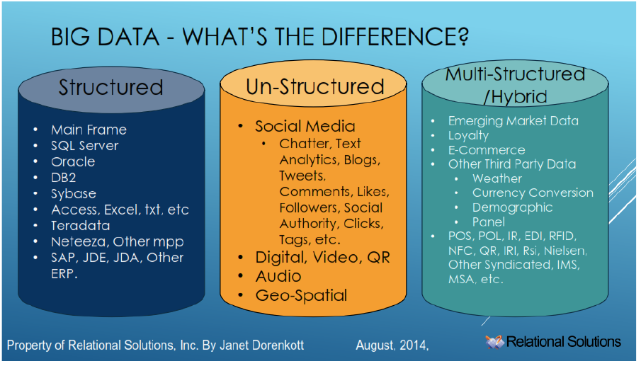
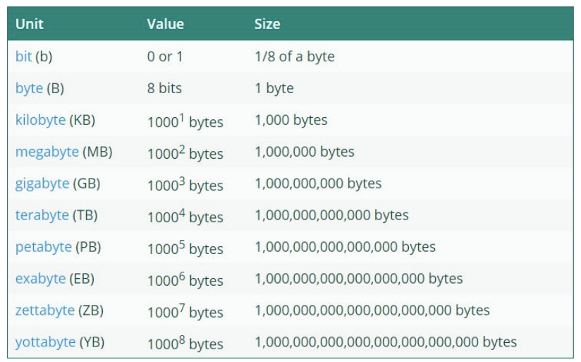
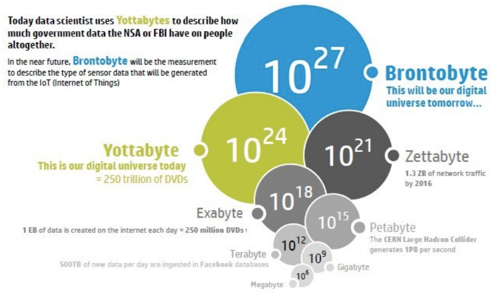
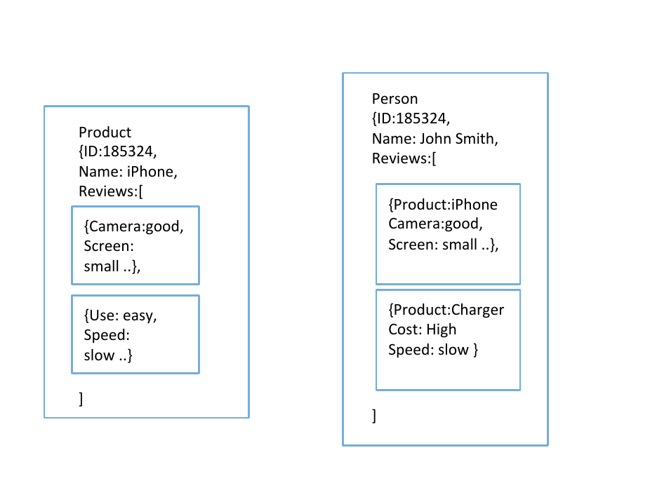

# CSCU9YQ - NoSQL Databases

# Introduction

## Relational databases



- Data expressed as tuples (a set of attribute/value pars) -> Rows
- A set of tuples that all share the same attributes is called a relation -> Table
- Schema: table, column name & types. Stable over time. Not Expected to change
- Primary keys uniquely identify rows within a table
- Foreign key fields are used in one table to refer to a row in another table
- Uses the Structured Query Language (SQL)
- Dominant technology for over 20 years
- Why is it so successful? Because it provides
  - **Persistence**: keep large amounts of persistent data
  - **Concurrency control**: many users simultaneously. Coordinate to avoid errors. This is done via Transactions
  - **Integration mechanisms**: multiple applications, written by different teams, access the same data
  - **A standard model**: developers can learn the relational model and apply it in many projects. SQL dialects are very similar

## What is a Data Model?

- In general, a model is a perception of the structures of reality (system we want to model)
- Data Models contain formalism for expressing
  - data structures
  - constraints
  - operations
  - keys and identifiers
  - integrity and consistency
- describes how we interact with data in the DB

## What is NoSQL?

- new generation of databases that differ from the Relational Model
- new features and practices that are best suited for a new type of applications and "Big Data"
- RDBs excel at maintaining consistency, but many sacrifice performance (schema checks)
- there are limits to how big RDBs can scale
- NoSQL dbs focus on performance over consistency
  - data have structure, but without enforcing fixed schema
  - data is replicated across many nodes asynchronously

## What is Big Data?

> Big Data - Massive amounts of complex data that require special techniques for acquisition, storage, distribution and analysis

- any aspects of our lives produce data: shopping, communicating, reading news, music searches, expressing opinions - all is tracked
- transmitted by sensors and mobile devices
- traditional data processing software is inadequate
- much of this data comes in an unstructured form (ie not structured tables in row & columns)

### Big data

- Structured
  - relational databases
  - spread sheet
- Unstructured
  - text and multimedia content
  - e-mail, videos, audio, written documents
  - Geospatial data





## Units of data storage



### Brontobytes



## Main Factor for NoSQL emergence: clusters

- increase of scale (what is now called Big Data), produced a need of more computing resources
- Two options
  - **Scaling up (vertical)**: bigger machines, more processors, disk, storage and memory. More expensive (+limits)
  - **Scaling out (horizontal)**: use a lots of small machines in a cluster. Much cheaper, and more resilient (keep going despite failures)
- RDB are not designed to run efficiently on clusters,  while NoSQL have been designed to run on clusters

### Other factors

- Object Relational Impedance Mismatch
  - we like to program in object oriented languages
  - the objects don't match well with the structure of the RDB
- From **integration DB** to **Application DB**
  - movement away fro musing DB as integration - multiple applications, several teams
  - Towards an application DB - only looked by a single application, single team. Application responsible for DB integrity

## Application databases

- Service Oriented Architectures (web services) communicate over HTTP in a format that is divorced from the database
- e.g. XML or JSON, richer data structures
- NoSQL DB offer more flexibility for the data structure to communicate
- Developers can choose the right DB for the right application

## The NoSQL term

- Term coined in 2009 by Johan Oskarrson who needed a short hashtag for a meeting he was arranging (accidental neologism)
- Not a good name for a number of reasons
  - Says what it is not, not what it is
  - Best used as an umbrella term for new generation databases
  - There is no prescriptive definition. Best described as a set of common characteristics

### Characteristics of NoSQL Databases

- Not using the relational model
- running well on clusters
- open-source
- flexible schema (freely add fields to db records, without needing to define a fixed schema first)
- Big data, web applications

## Types of NoSQL DB by Data Model

| Data Model    | Examples databases                                           |
| ------------- | ------------------------------------------------------------ |
| Key-value     | BerkelyDB, LevelDB, Memcached, Projects Voldemort, Redis, Riak |
| Document      | CouchDB, **MongoDB**, OrientDB, RavenDB, Terrastore          |
| Column-Family | Amazon SimpleDB, **Cassandra**, HBase, Hypertable            |
| Graph         | FlockDBm HyperGraphDB, Infinite Graph, **Neo4J**, Orient DB  |

## Aggregate Data Models

- From the 4 types of NoSQL DB, the first 3 (key-value, document and column-family) share an Aggregate orientation
- **Aggregate orientation**
  - recognise the need to operate in units that have a more complex structure than a set of rows
  - such as a complex record with lists and other records nested
- **Aggregate**: a collection of related objects that we wish to treat as a unit (for manipulation & consistency)

### Example: product review database

> Product: iPhone 5
> Price: £500
> Camera: Fine
> Screen: Very good
> Accessories: Headphone, Case, ....

> Product: iPhone 5
> Price: £500
> Camera: Excellent
> Screen: Poor in sunshine
> Operating system: Easy to use

- Different products have different fields
- some fields have several values
- products are related to other products as accessories
- a new product may have new qualities (fields) not yet in the database
- the same product may appear many times with different values and fields

## JSON: Javascript Object Notation

- Light-weight text data interchange format, language independent
- Easy for humans to read and write
- Easy for computers to parse and generate

```json
{
    Id:847543,
    Name:iPhone5,
    Features:[GPS,Retina Display,Siri],
    Reviews:[
        {Reviewer:458743,Date:12.4.1013,Speed:Slow},
        {Reviewer:636534,Date:2.5.1013,Camera:Great},
    ]
}
```

## Aggregate design

- there is a new freedom, away from ER models
- but with more choice come more decisions
- for our product review database ,potential units to aggregate are>
  - **Users** - keep all a person's review together
  - **Products** - keep all the reviews of a product together



### What is the best aggregate?

- which design you choose depends in part on what is the most common query?
  - list all reviews from a given customer
  - list all reviews of a given product
  - find all products that are 'fast'

### Aggregates help with NoSQL ACID

- atomic, consistent, isolated and durable: Relational databases key strength and requirement for transactions
- aggregates help impose atomicity in NoSQL DB - an aggregate is updated in a single transaction
- aggregates are central to running on a cluster - data for an aggregate is stored on one node
- NoSQL types (key-value, document, column) share the notion of an aggregate indexed by a key. They differ in the characteristics of the aggregate

# Introduction to MongoDB

- Cross-platform, open-source document database
- provides
  - high performance
  - high availability
  - automatic scaling
- useful links
  - https://www.mongodb.com/
  - https://docs.mongodb.com/manual/
  - https://university.mongodb.com/ (free learning material)

## MongoDB Strength

- stores data in flexible, JSON/like documents, meaning fields can vary from document to document and data structure can be changed over time
- the document model maps to the objects in your application code, making data easy to work with
- ad hoc queries, indexing, and real time aggregation provide powerful ways to access and analyse your data
- distributed database at its core, so high availability, horizontal scaling, and geographic distribution are built in and easy to use

## Document database

- a record in MongoDB is a document, similar to JSON objects
- data structure composed of field and value pairs
- the values of fields may include other documents, arrays and arrays of documents

## BSON (Binary JSON)

- MongoDB stores data records as BSON docs
- BSON is a binary representation of JSON docs, though it contains more data types than JSON
- For example, BSON has a Date type and a BinDate type
- Like JSON, BSON supports the embedding of docs and arrays within other docs and arrays
- Useful links
  - http://bsonspec.org/
  - https://docs.mongodb.com/manual/reference/bson-types/

## Document Structure

- MongoDB documents are composed of field-and-value pairs
  - The value of a field can be any of the BSON data types, including other documents, arrays and arrays of documents

```json
{
    field1: value1,
    field2: value2
}
```

### Example of MongoDB Document

```json
var mydoc = {
    _id: ObjectId("5099803df3f4948bd2f98391"),
    name: { first: "Alan", last: "Turing" },
    birth: new Date('Jun 23, 1912'),
    death: new Date('Jun 07, 1954'),
    contribs: [ "Turing machine", "Turing test” ],
    views : NumberLong(1250000)
}
```

- _id holds an ObjectId
- name holds an embedded document that contains the fields first and last
- birth and death hold values of Date type
- contribs holds an array of strings
- views holds a value of NumberLong type

### Primary key: _id field

- each document requires a unique _id field that acts as primary key
- if an inserted document omits the _id field, MongoDB automatically generates and ObjectId
  - 12 bytes, where the first 4 bytes are a timestamp of the ObjectId's creation. Specifically:
    - a 4 byte value representing the seconds since the Unix epoch
    - a 5 byte random value
    - a 3 byte counter, starting with a random value

### Databases and collections

- BSON documents (data records) are stored in collections, which are analogous to tables in RD
- Collections are stored in databases

## Mongo shell

- interactive JavaScript shell interface to MongoDB
- allows us to manipulate databases, collections and documents
- powerful interface to test queries and operations
- provides a fully functional JS environment
- useful links:
  - https://docs.mongodb.com/manual/reference/mongo-shell/
  - https://mws.mongodb.com/?version=3.6

## Query language

- rich query language to support CRUD operations
  - create (insert) operations
  - read
  - update
  - delete
  - bulk write
- dot notation is used to access the fields of documents, embedded documents and elements of arrays
- data aggregation
- text search and geospatial queries

### Create databases

- to select an existing database to use, in the mongo shell: use myDB

- if a database does not exists, mongodb creates the database when you first store data for that database

- so you can switch to a non/existent database and perform the following operation in the mongo shell

  - ```json
    use myNewDB
    
    db.myNewCollection1.insertOne( { x: 1  } )
    ```

### Create collections

- MongoDB stores documents in collections. Collections are analogous to tables in RD
- the db.createCollection() method explicitly creates a collection with various options (max size, validation rules)
- if a collection odes not exist, MongoDB creates the collection when you first store data for that collection
- operations for inserting documents create their respective collection if they do not already exist

```json
db.myNewCollection2.insertOne( { x: 1 } )
db.myNewCollection3.createIndex( { y: 1 } )
```

### Insertion operations

- add new documents to a collection
- insert operations target a single collection
- write operations are atomic on the level of a single document
- two operations
  - db.collection.insertOne()
  - db.collection.insertMany()

```json
db.users.insertOne(
    {
        name: "Sue",
        age: 26,
        status: "pending"
    }
)
```

#### Example

- ```json
  db.inventory.insertOne(
      { 
          item: "canvas", 
          qty: 100, 
          tags: ["cotton"], 
          size: { h: 28, w: 35.5, uom: "cm" } 
      }
  )
  
  ```

  - inserts a new document into the inventory collection
  - if the document does not specify an _id field, MongoDB adds the _id field with an ObjectId value to the new document

- ```json
  db.inventory.insertMany([
      { 
          item: "journal", 
          qty: 25, 
          tags: ["blank", "red"], 
          size: { h: 14, w: 21, uom: "cm" } 
      },
      {
          item: "mat", 
          qty: 85, 
          tags: ["gray"], 
          size: { h: 27.9, w: 35.5, uom: "cm" } 
      },
      {
          item: "mousepad", 
          qty: 25, 
          tags: ["gel", "blue"], 
          size: { h: 19, w: 22.85, uom: "cm" } 
      }
  ])
  
  ```

  - inserts 3 new documents into the inventory collection
  - if the document does not specify an _id field, MongoDB adds the _id field with an ObjectId value to each document

### Read operations

- Retrieve documents from a collection; ie queries a collection for documents
- Method: db.collection.find()
- You can specify query filters or criteria that identify the documents to return
- The shell returns a cursor with the  data retrieved, by default the cursor iterates over the first 20

```json
db.users.find(				// collection
    { age: {$gt: 18}}, 		// query criteria
    { name: 1, address: 1} 	// projection
).limit(5)					// cursor modifier
```

#### Examples

```json
db.inventory.insertMany([
{ item: "journal", qty: 25, size: { h: 14, w: 21, uom: "cm" }, status: "A" },
{ item: "notebook", qty: 50, size: { h: 8.5, w: 11, uom: "in" }, status: "A" },
{ item: "paper", qty: 100, size: { h: 8.5, w: 11, uom: "in" }, status: "D" },
{ item: "planner", qty: 75, size: { h: 22.85, w: 30, uom: "cm" }, status: "D" },
{ item: "postcard", qty: 45, size: { h: 10, w: 15.25, uom: "cm" }, status: "A" }
]);
```

- Select all documents in the collection, pass empty doc {} as the parameter
  - *db.inventory.find({})*
- Specify equality conditions, use *<field>:<value>* expressions
  - *db.inventory.find({status: "D"})*
- Specify conditions using query operators
  - *db.inventory.find({status : {$in: ["A", "D"]})*
- Specify and conditions
  - *db.inventory.find({status: "A", qty: {$lt: 30}})*
- There is more to Query! See examples at:
  https://docs.mongodb.com/manual/tutorial/query-documents/

### Update operators

- modify existing documents in a collection

- methods

  - ```json
    db.collection.updateOne(<filter>, <update>, <optios>)
    ```

  - ```json
    db.collection.updateMany(<filter>, <update>, <optios>)
    ```

  - ```json
    db.collection.replaceOne(<filter>, <update>, <optios>)
    ```

- target a singe collection

- write operators are atomic on the level of a single document

- more: https://docs.mongodb.com/manual/tutorial/update-documents/

```json
db.users.updateMany(				// collection
    { age: {$lt: 18}},				// update filter
    { $set: {status: "reject"}}		// update action
)
```

### Delete operators

- modify existing documents in a collection
- methods
  - db.collection.deleteMany()
  - db.collection.deleteOne()
- target a single collection
- write operators are atomic on the level of a single document
- more: https://docs.mongodb.com/manual/tutorial/remove-documents/

```json
db.usres.deleteMany(		// collection
	{ status: "reject"}		// delete filter
)
```

